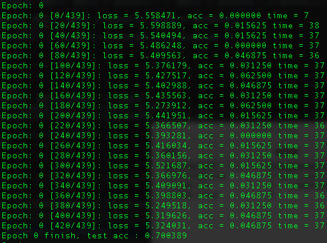

# Distribued Neural Network on Edge Devices

1. Put **256_ObjectCategories.tar** in data and unzip it.

2. Caltech01.py and Caltech02.py are designed to preprocess the dataset, use ```python3 Caltech02.py``` to get *dataset-test.txt* and *data-train.txt*, which are used to load the data when running the main.py.

3. Use ```python3 main.py``` to run. Use ```python3 main.py --help``` to see some parameters.

4. 	Now, I have changed some codes to accelerate the training speed. It just takes 2 sce for each batch, and about 10 minutes for each batch.

	
	