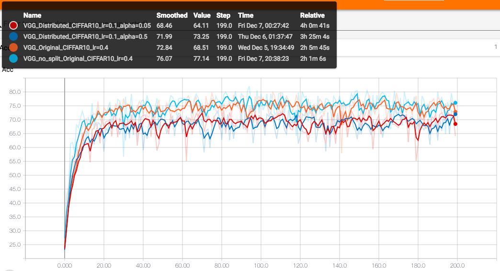

# Distribued Neural Network on Edge Devices

1. Put **256_ObjectCategories.tar** in data and unzip it.

2. Caltech01.py and Caltech02.py are designed to preprocess the dataset, use ```python3 Caltech01.py``` to generate *label.txt* and use ```python3 Caltech02.py``` to split the data into training set and testing set.

3. Use ```python3 main.py``` to run. Use ```python3 main.py --help``` to see some parameters.

4. Results

	+ VGG16 & CIFFAR10 & 200 epoches
	
		+ **no_split** means no split in feature 1 and feature 2 in VGG16.
		+ **alpha** is the probability in dropout, which I use to mimics the loss of the edge pixels.

	+ VGG16 & Caltech256 & 200 epoches

		Not finish........
	
	
	