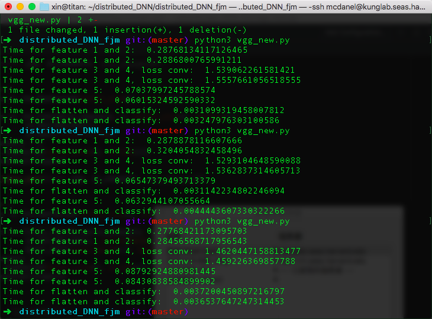
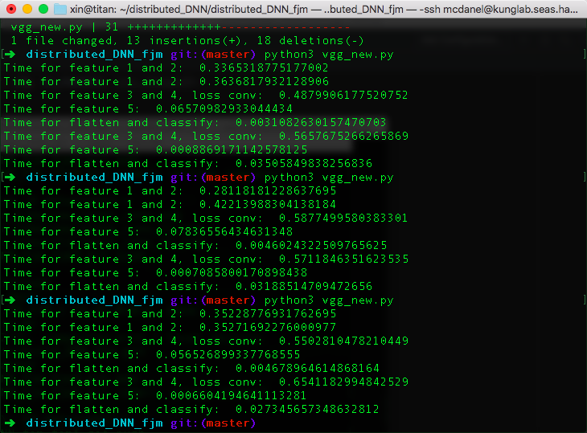
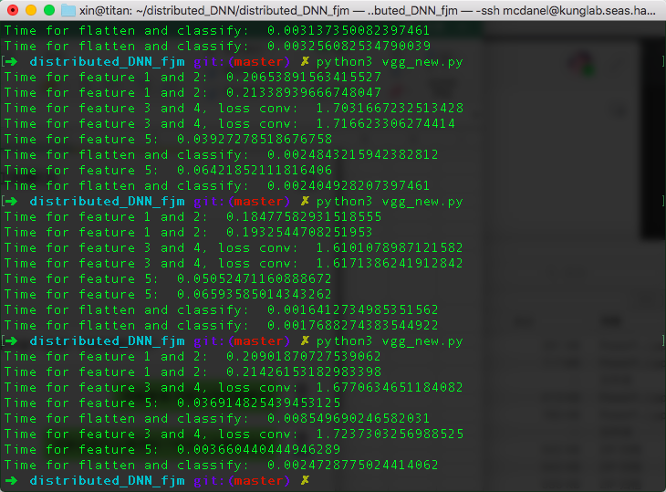
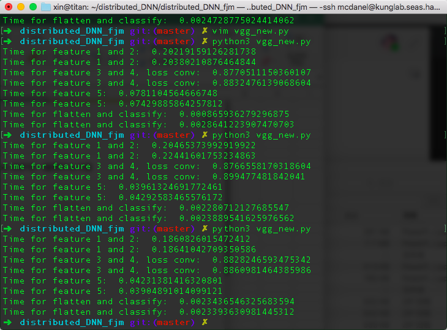
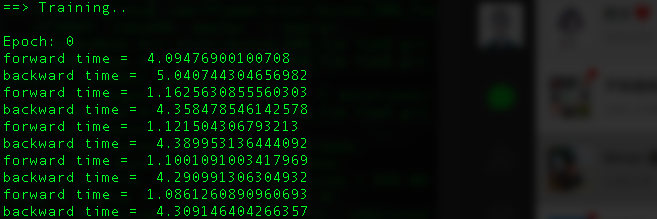
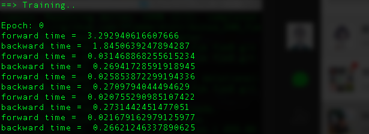

# Distribued Neural Network on Edge Devices

1. Put **256_ObjectCategories.tar** in data and unzip it.

2. Caltech01.py and Caltech02.py are designed to preprocess the dataset, use ```python3 Caltech02.py``` to get *dataset-test.txt* and *data-train.txt*, which are used to load the data when running the main.py.

3. Use ```python3 main.py``` to run. Use ```python3 main.py --help``` to see some parameters.

4. There are 5 features in the VGG model. We first divide the input *x* into 4 parts: *x11, x12, x21, x22*, and then apply the feature 1 and feature 2 on *x11, x12, x21, x22*. Then, in the feature 3 and feature 4, we use lossy conv2d to mimic the loss of the edge pixels. Third, we put the small parts together, and apply the feature 5. Finally, we flatten the matrix and use a FC layer to do the classify. Here, I compare the time that each feature spends in forward.
	
	+ Use lossy_conv2d _new, batch size is 64.
	
	
	+ Do NOT use lossy_conv2d, batch size is 64.
	
	
	+ Use lossy_conv2d, batch size is 64.
	
		OOM, because too many matrixes are defined.
		
	+ Use lossy_conv2d, batch size is 32.
	
	
	+ Use lossy_conv2d _new, batch size is 32.
	
	
	
	Two mainly results:
	
	1. Using lossy_conv2d spends about 3 times more time than normal conv2d, but I THINK it's **acceptable**.
	
	2. The **new** lossy conv2d only takes half the time of the **old** lossy conv2d, and significantly reduces memory usage.

5. However, when I use lossy conv2d to train the model, I found it's much slower than the model without lossy conv2d. Then I print the forward time and backward time for each batch.
	
	+ Result for the model with lossy conv2d
	
	
	+ Result for the model without lossy conv2d
	

	At the first forward and backward process, they spend almost the same amount of time. However, for the following processes, the model with lossy conv2d really spends much more time than the model without lossy conv2d.


6. The training is really slow. I'm a little confused about adjusting the parameters.....
	
	
